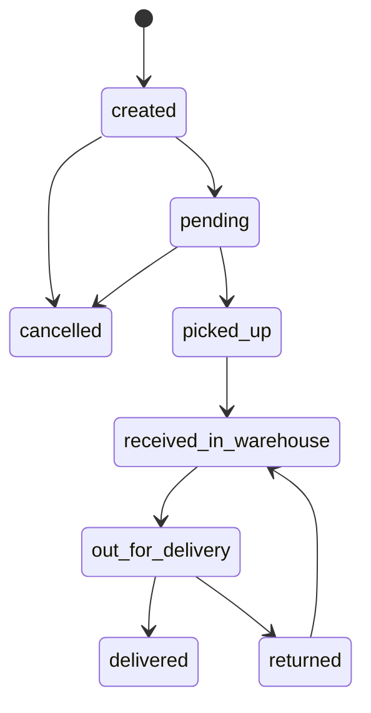

# Logistics Core SaaS

Logistics Core SaaS is a Laravel backend foundation for multi-tenant delivery, merchant, warehouse, driver, and shipment operations. The project focuses on clean architecture, strong tenant isolation, token-based authentication, and fast bitwise authorization for high-throughput logistics workflows.

## Project Strengths

- **Clean architecture first:** business logic lives in action classes with immutable DTOs, not fat controllers or models.
- **Multi-tenant database design:** tenants own users, warehouses, shipments, merchant profiles, and tracking logs.
- **Tenant data isolation:** scoped Eloquent models automatically restrict authenticated queries to the current tenant (fail-closed when `tenant_id` is missing).
- **Bitwise permission system:** permissions are stored as an integer mask for fast authorization checks.
- **Redis-backed idempotency:** mutating API endpoints require a unique `X-Idempotency-Key` header, cached for 60 seconds to prevent duplicate operations.
- **Auth rate limiting:** public auth endpoints are throttled at 10 requests/minute per IP.
- **Strict API contracts:** JsonResource transformers and feature tests enforce response shapes, status codes, and database side effects.
- **FSM-protected shipment lifecycle:** shipment creation is initialized at `created` and guarded by a finite state machine that blocks illegal status jumps.
- **Graph-driven lifecycle actions:** shipment/order actions follow a deterministic state graph to prevent unauthorized transition jumps.
- **Audit-grade shipment logs:** every shipment transition is recorded with `tenant_id`, `action_type`, and `triggered_by` metadata.
- **Production-minded testing:** PHPUnit plus Paratest support sequential and parallel test execution.
- **CI-ready workflow:** GitHub Actions run formatting, static analysis, and parallel tests for pull requests.

## Tech Stack

- PHP 8.5 with `declare(strict_types=1)` across `app/`, `tests/`, and routes
- Laravel 13
- Laravel Sanctum
- PostgreSQL
- Redis
- Docker Compose / Laravel Sail
- PHPUnit 12
- Paratest
- Laravel Pint

## Core Domain

The current backend foundation includes:

- Tenants for logistics companies (identified by unique subdomain)
- Users with tenant membership, privileged provisioning, and status control
- Staff users with driver or warehouse manager permission defaults
- Merchant profiles with pickup information and tenant isolation
- Warehouses scoped to tenants
- Shipments connected to merchants, drivers, warehouses, and tenants
- Shipment logs for status transitions with dedicated `tenant_id`
- Personal access tokens for API authentication

## Permission Model

Permissions are defined in `App\Enums\Permission` and stored on users as `permissions_mask`.

| Permission | Value | Purpose |
| --- | ---: | --- |
| `CREATE_SHIPMENT` | 1 | Merchant shipment creation |
| `VIEW_SHIPMENT` | 2 | Shared shipment visibility |
| `SORT_PACKAGES` | 4 | Warehouse package sorting |
| `ASSIGN_DRIVERS` | 8 | Admin or management dispatch |
| `DELIVER_SHIPMENT` | 16 | Driver delivery workflow |
| `MANAGE_TENANT` | 32 | Tenant administration |

Default masks:

- Merchant: `CREATE_SHIPMENT | VIEW_SHIPMENT`
- Driver: `VIEW_SHIPMENT | DELIVER_SHIPMENT`
- Warehouse: `VIEW_SHIPMENT | SORT_PACKAGES`

Routes combine Sanctum authentication, bitwise permission middleware, and idempotency where required:

```php
Route::middleware(['auth:sanctum', 'idempotency'])->group(function () {
    Route::middleware('permission:CREATE_SHIPMENT')->group(function () {
        Route::post('/shipments', StoreShipmentController::class);
    });
});
```

## Idempotency

Mutating endpoints require a unique `X-Idempotency-Key` header. The middleware stores the response in Redis for 60 seconds (configurable via `IDEMPOTENCY_TTL_SECONDS`). Replayed keys with identical payloads return the cached response; mismatched payloads return `409 Conflict`.

| Header | Required on | Description |
| --- | --- | --- |
| `X-Idempotency-Key` | Registration, staff, shipments | Client-generated unique key, max 120 characters |

Response headers:

| Header | Values | Description |
| --- | --- | --- |
| `X-Idempotency-Cache` | `MISS` / `HIT` | Whether the response was freshly processed or replayed from cache |

Configuration (`.env`):

```env
IDEMPOTENCY_CACHE_STORE=redis
IDEMPOTENCY_TTL_SECONDS=60
IDEMPOTENCY_LOCK_SECONDS=30
```

## Rate Limiting

Public auth routes use the `auth` rate limiter (10 requests/minute per IP):

- `POST /api/auth/register-company`
- `POST /api/auth/register-merchant`
- `POST /api/auth/login`

## API Endpoints

| Method | Endpoint | Auth | Permission | Idempotency Key |
| --- | --- | --- | --- | --- |
| `POST` | `/api/auth/register-company` | — | — | Required |
| `POST` | `/api/auth/register-merchant` | — | — | Required |
| `POST` | `/api/auth/login` | — | — | — |
| `GET` | `/api/auth/me` | Bearer | — | — |
| `POST` | `/api/auth/logout` | Bearer | — | — |
| `POST` | `/api/staff` | Bearer | `MANAGE_TENANT` | Required |
| `POST` | `/api/shipments` | Bearer | `CREATE_SHIPMENT` | Required |

## Quick Start

Clone the repository and install dependencies:

```bash
git clone git@github.com:YousefBZo/logistics-core-saas.git
cd logistics-core-saas
composer install
cp .env.example .env
```

Start the Docker services:

```bash
docker compose up -d
```

Generate the application key and migrate the database:

```bash
docker compose exec laravel.test php artisan key:generate
docker compose exec laravel.test php artisan migrate
```

Run the test suite:

```bash
docker compose exec laravel.test composer test
docker compose exec laravel.test php artisan test --parallel --processes=2
```

Check formatting:

```bash
docker compose exec laravel.test ./vendor/bin/pint --test
```

## Example API Usage

Register a logistics company:

```bash
curl -X POST http://localhost/api/auth/register-company \
  -H "Content-Type: application/json" \
  -H "X-Idempotency-Key: company-$(uuidgen)" \
  -d '{
    "company_name": "Acme Logistics",
    "subdomain": "acme-hub",
    "name": "Acme Admin",
    "email": "admin@example.com",
    "phone": "+15550100001",
    "password": "password-secret",
    "password_confirmation": "password-secret"
  }'
```

Register a merchant (bound to tenant via public subdomain, not internal tenant ID):

```bash
curl -X POST http://localhost/api/auth/register-merchant \
  -H "Content-Type: application/json" \
  -H "X-Idempotency-Key: merchant-$(uuidgen)" \
  -d '{
    "tenant_subdomain": "acme-hub",
    "name": "North Store",
    "email": "merchant@example.com",
    "phone": "+15550100002",
    "password": "password-secret",
    "store_name": "North Storefront",
    "pickup_address": "12 Market Street"
  }'
```

Log in:

```bash
curl -X POST http://localhost/api/auth/login \
  -H "Content-Type: application/json" \
  -d '{
    "email": "admin@example.com",
    "password": "password-secret"
  }'
```

Use the returned token:

```bash
curl http://localhost/api/auth/me \
  -H "Authorization: Bearer YOUR_ACCESS_TOKEN"
```

Create a shipment (merchant token or staff/admin token with `CREATE_SHIPMENT`):

```bash
curl -X POST http://localhost/api/shipments \
  -H "Authorization: Bearer YOUR_ACCESS_TOKEN" \
  -H "Content-Type: application/json" \
  -H "X-Idempotency-Key: shipment-$(uuidgen)" \
  -d '{
    "merchant_id": 12,
    "customer_name": "Customer One",
    "customer_phone": "+970599000001",
    "city": "Hebron",
    "area_or_zone": "H1",
    "detailed_address": "Main street, building 12",
    "cod_amount": "25.5000",
    "delivery_fees": "3.2500",
    "weight_kg": "2.50"
  }'
```

`merchant_id` behavior is role-aware and tenant-scoped:

- Merchant actor: any provided `merchant_id` is ignored and replaced by the authenticated merchant ID (anti-spoof protection).
- Staff/Admin actor: `merchant_id` is required and must belong to the same `tenant_id`.

The `cod_amount` field is validated with precision `(12,4)`.

Tracking numbers are generated in scanner-safe format: `TRK-YYYYMMDD-XXXXXX`.

Allowed shipment status transitions are enforced by `ShipmentStateMachine`:

- `created -> pending | cancelled`
- `pending -> picked_up | cancelled`
- `picked_up -> received_in_warehouse`
- `received_in_warehouse -> out_for_delivery`
- `out_for_delivery -> delivered | returned`
- `returned -> received_in_warehouse`
- `cancelled`, `delivered` are terminal states.

### Order Lifecycle Action Graph



Lifecycle graph benefits:

- Prevents invalid or out-of-order operational actions.
- Makes business rules explicit and reviewable for engineering and operations teams.
- Produces high-quality transition telemetry for SLA analytics and incident audits.
- Simplifies extension of new actions while preserving formal transition safety.

Onboard staff (tenant admin token required):

```bash
curl -X POST http://localhost/api/staff \
  -H "Authorization: Bearer YOUR_ACCESS_TOKEN" \
  -H "Content-Type: application/json" \
  -H "X-Idempotency-Key: staff-$(uuidgen)" \
  -d '{
    "name": "Route Driver",
    "email": "driver@example.com",
    "password": "password-secret",
    "phone": "+15550100020",
    "role_type": "driver"
  }'
```

## Testing Strategy

The test suite covers:

- Permission bit values and default masks
- Tracking number generation (`TRK-YYYYMMDD-XXXXXX`)
- Shipment creation action transaction, FSM guard, and initial audit log write
- Staff creation action tenant binding, password hashing, and default masks
- Staff onboarding API contract (driver and warehouse manager), idempotency replay, and permission guard
- Shipment creation API contract, tenant-scoped warehouse validation, and idempotency replay
- Company and merchant registration contracts, subdomain binding, and idempotency replay
- Merchant registration security (unknown subdomain rejection, ignored client `tenant_id`)
- Duplicate identity validation and invalid login rejection
- Login token issuance and suspended user rejection
- Authenticated `/api/auth/me` and logout behavior
- Permission middleware allow, deny, and developer-error paths
- Tenant-scoped query isolation for users, shipments, warehouses, and merchant profiles

## GitFlow

This repository follows a GitFlow-style workflow:

- `main` is the production-ready branch.
- `develop` is the integration branch.
- Feature branches should use professional slugs, for example `feature/auth-db-bitwise-permissions`.
- Pull requests should merge feature branches into `develop`.
- Release-ready `develop` changes can then be merged into `main`.

## Current Status

The project provides a tested backend foundation for multi-tenant authentication, staff onboarding, merchant registration, shipment creation with atomic tracking logs, Redis idempotency, auth rate limiting, and strict tenant isolation across operational models.
